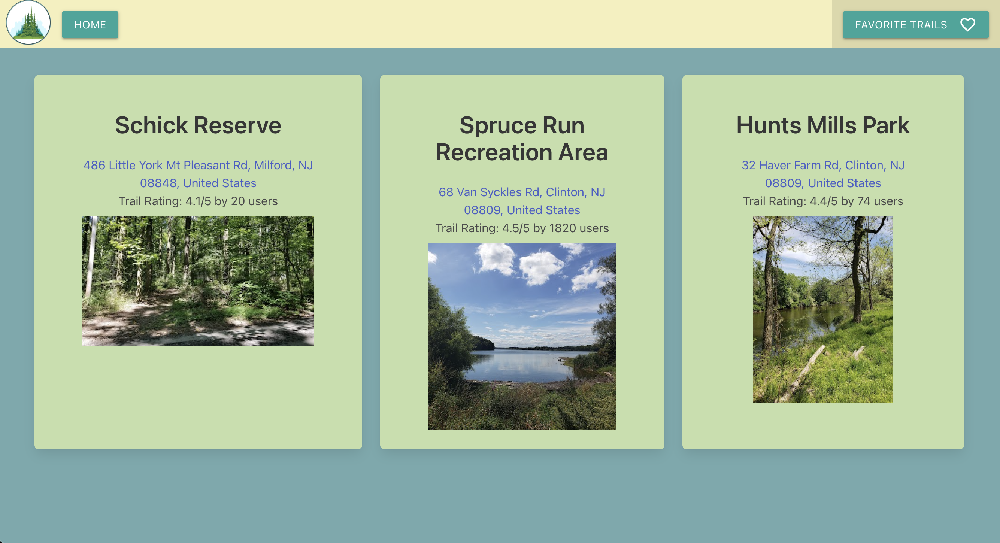
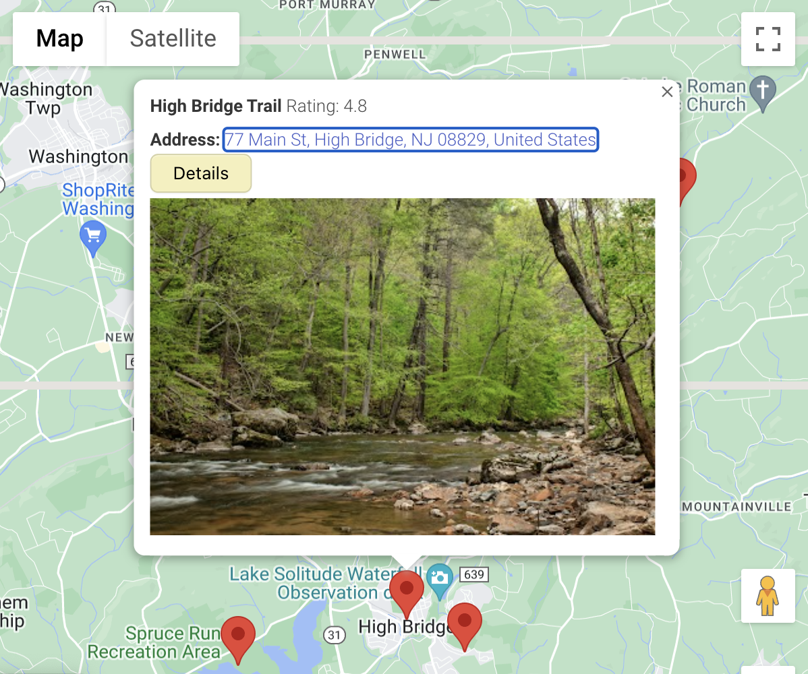
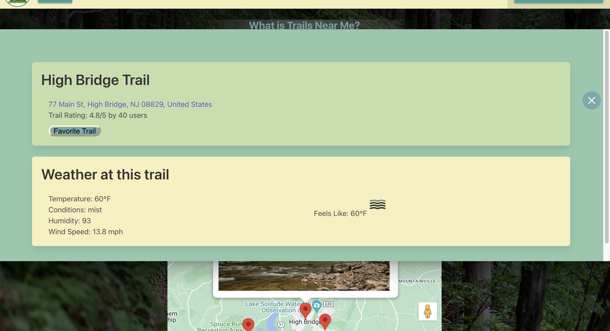

# Trails Near Me

Trails Near Me is a web app that finds all trails near the user based off the user's browser location. This app uses Google Maps API as well as openweathermap API to find the trails and also give the user details about the trails and the current weather conditions at the trails. 

The live app can be found at <https://huntermuratore.github.io/trails-near-me/>

